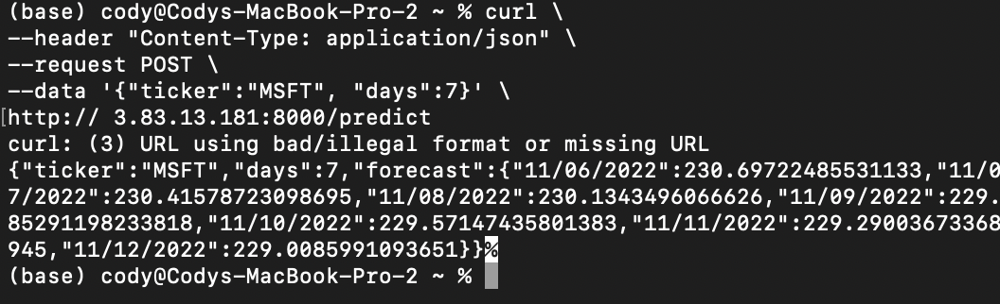
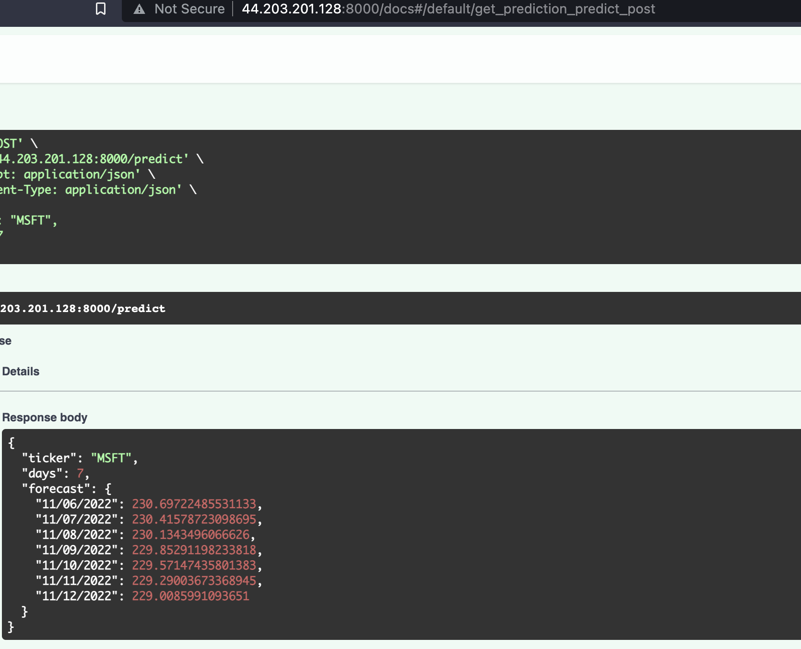

# stock-predictor

## Curl command

curl \
--header "Content-Type: application/json" \
--request POST \
--data '{"ticker":"MSFT", "days":7}' \
http://44.203.201.128:8000/predict

## Images

### Curl dommand

### GUI command

## Canvas Answers
- How does the Prophet Algorithm differ from an LSTM?
  - Prophet is a business trends algorithm that aims to combine seasonality, trend, holidays, and error rates in order to make time series predictions. 
  - LSTMs are a special type of RNN, which is a neural network aimed at predicting sequential data, including timer series.
- Why does an LSTM have poor performance against ARIMA and Prophet for Time Series?
  - LSTM is very prone to overfitting with time series data. It also fails to account for things like seasonality.
- What is exponential smoothing and why is it used in Time Series Forecasting?
  - Time series models use a weighted sum of past events when making a prediction. Exponential smoothing uses an exponential function to decrease the weight of past events, so that events become less and less relevant over time.
- What is stationarity? 
  - A time series without an obvious trend. Meaning there are no seasonal changes evident.
- What is seasonality? 
  - Predictible changes in time series data that correlates with certain seasons (i.e. holiday spending increases)
- Why Is Stationarity Important in Time Series Forecasting?
  - Because with stationarity, you would want to use different forcasting methods, so as not to change model during seasonal predictions.
- How is seasonality different from cyclicality? Fill in the blanks:
___ is predictable, whereas ___ is not.
  - Seasonality is predicatable, whereas cyclicality is not.
