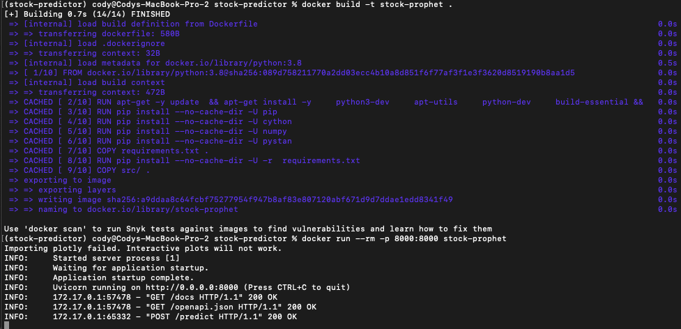
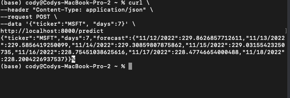

# stock-predictor-container-branch

## Docker build

## Curl command

## Ping command

### GUI command

## Canvas Answers
- What does it mean to create a Docker image and why do we use Docker images?
  - A docker image is a set of instructions that will be used to build a Docker container. Creating a Docker image simply means compiling these instructions into a format that can be shared, so that anyone with the image can build the same container, with the same environment. We use Docker images because environment management is incredibly difficult across platforms, and without a tool like Docker, people can not easily run code on their machines.
- Please explain what is the difference from a Container vs a Virtual Machine?
  - A container is a lightweight software package that allows you to create a new environment, leveraging the local hardware, but with a different set of packages, dependencies, etc, for the purposes of running software. In contrast, a VM is a partitioned portion of your computer, with dedicated RAM, which completely mimics another machine, including all hardware, OS, etc. They are similar, but VMs are more partitioned, and provide more security, while being a drag on resources.
- What are 5 examples of container orchestration tools (please list tools)?
  - Kubernetes is the big one, followed by;
  - Amazon Elastic Container Service
  - Red Hat OpenShift Container Platform
  - Helios
  - Aptible
- How does a Docker image differ from a Docker container?
  - A Docker image is just a set of instructions for building a container. A Docker container is the virtual environment, built from the image, capable of running software, with all dependencies installed.